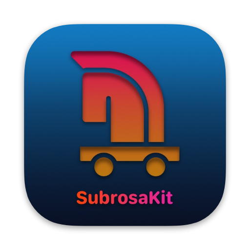
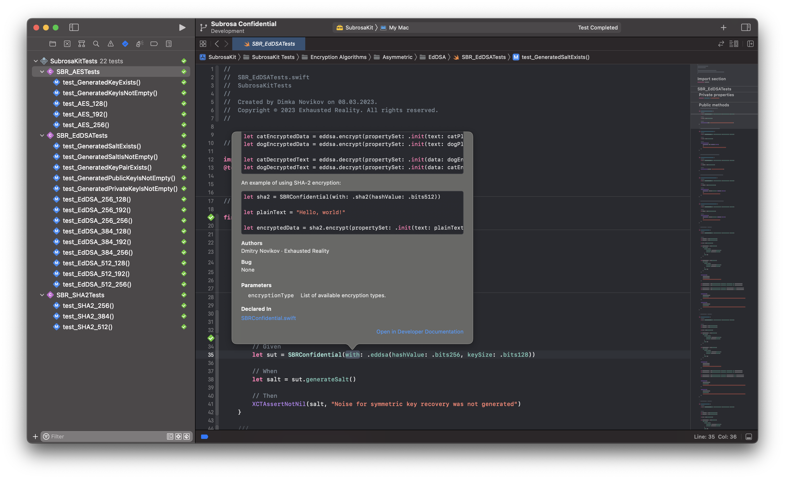
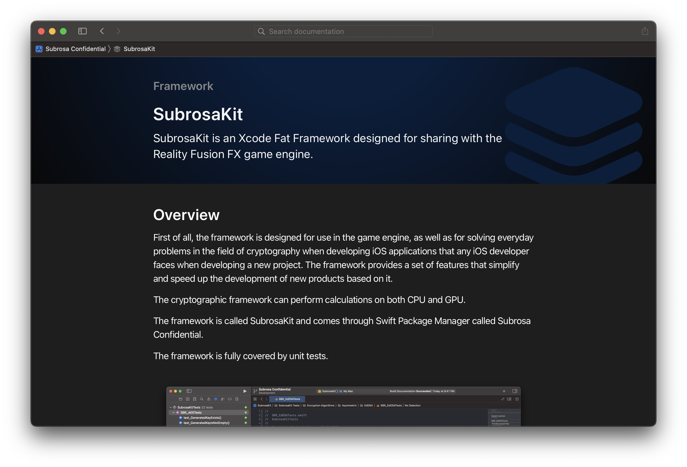
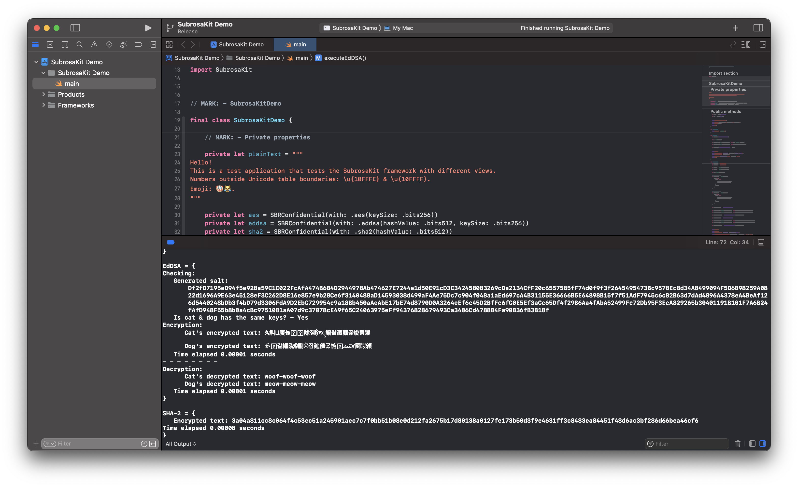

<p align="center"> 
 
</p>

<p align="center">
 <a title="Swift Language" href="https://github.com/apple/swift">
  
 </a>
 <a title="Xcode IDE" href="https://apps.apple.com/ru/app/xcode/id497799835?l=en&mt=12">
  
 </a>
 <a title="iOS">
  
 </a>
</p>

<p align="center">
 <a href="https://git.io/typing-svg">
 </a>
</p>

### Current Release:
**Status:** `Stable`  
**Version:** `1.0.0`  
**Build:** `1`

#### SubrosaKit is an [Xcode Fat Framework](#full-description) written in [Swift 5](https://github.com/apple/swift) and designed for sharing with the Reality Fusion FX game engine.
The cryptographic framework can perform calculations on both CPU and GPU.  
The framework is called SubrosaKit and comes through Swift Package Manager called Subrosa Confidential.

#### `Xcode 14.0+` ﹒ `Swift 5.7+` ﹒ `iOS 16.0+` ﹒ `iPadOS 16.0+` ﹒ `macOS Ventura 13.0+` 

- - -

## Table of Contents

* **About the framework**
  * [Full description](#full-description)
  * [Used technologies](#used-technologies)
* **How to add a dependency?**
  * [Swift Package Manager](#swift-package-manager)
  * [Another way](#another-way)
* **Documentation Catalog**
  * [Documentation](#documentation)
* **Features Set**
  * [SDK Specification](#sdk-specification)
  * [Encryption Algorithms](#encryption-algorithms)
* **Availability**
  * [Supported devices](#supported-devices)
    * [iPhone](#iphone)
    * [iPad](#ipad)
    * [Mac](#mac)
  * [Supported OS](#supported-os)
    * [iOS](#ios)
    * [iPadOS](#ipados)
    * [macOS](#macos)
* **Other**
  * [Project e-mail](#project-e-mail)
* **License**
  * [SubrosaKit license](#subrosakit-license)

- - -

### About the framework

#### Full description

###### `Xcode Fat Framework`

**Name:** `SubrosaKit`  

**Environment:**  `Xcode IDE | Xcode CLT`  

**Target Platform:**  `🍏 Platforms`  

**Binary format:** `The framework comes as a binary file, which simplifies the assembly of projects in which it is used, as well as provides support for the necessary set of architectures, both for real devices and for simulators for the Apple and Intel platform`  

**What is it created for?** `First of all, the framework is designed for use in the game engine, as well as for solving everyday problems in the field of cryptography when developing iOS applications that any iOS developer faces when developing a new project. The framework provides a set of features that simplify and speed up the development of new products based on it`

#### Used technologies

`Foundation | Metal API | New Swift Concurrency` 

- - -

### How to add a dependency?

###### *The patch version varies depending on the releases with bug fixes and errors.*

The framework follows [Semantic Versioning](https://semver.org).

#### Swift Package Manager

You can install the framework using SPM by simply specifying a stable version of the release at the time of download.

#### Another way

You can also add a framework to the project by uploading the project from the github, transferring SubrosaKit.xcframework to the sidebar of the Xcode project.

- - -

### Documentation Catalog

#### Documentation

Xcode documentation in .docarchive format is also supplied together in the framework.

<p align="center"> 
 
</p>

<p align="center"> 
 
</p>

- - -

### Features Set

#### SDK Specification

To get information about the version and build of the framework, use:

```swift
let sdkVersion = SBRKit.info.version
print(sdkVersion)

let sdkBuild = SBRKit.info.build
print(sdkBuild)
```

#### Encryption Algorithms

The framework includes a set of three main encryption algorithms that may be required when solving everyday problems. Interaction with the framework can be viewed in the SubrosaKit Demo demo project or get more information in the documentation.

<p align="center"> 
 
</p>
    
- - -

### Availability

#### Supported devices
###### iPhone
`iPhone 8 | iPhone 8 Plus | iPhone X`﹒`or above`
###### iPad
`iPad mini (5th generation)`﹒`or above`  
`iPad (5th generation)`﹒`or above`  
`iPad Air (3rd generation)`﹒`or above`  
`iPad Pro 9.7-inch`  
`iPad Pro 10.5-inch`  
`iPad Pro 11-inch (1st generation)`﹒`or above`  
`iPad Pro 12.9-inch (1st generation)`﹒`or above`
###### Mac
`MacBook Pro (13", 2017)`﹒`or above`  
`MacBook Pro (15", 2017)`﹒`or above`  
`MacBook Pro (16", 2019)`﹒`or above`  
`MacBook Pro (14", 2021)`﹒`or above`  

#### Supported OS
###### iOS
`iOS 16.0`﹒`and higher`
###### iPadOS
`iPadOS 16.0`﹒`and higher`
###### macOS
`macOS Ventura 13.0`﹒`and higher`

- - -

### Other

#### Project e-mail
[ddec.team@gmail.com](mailto:ddec.team@gmail.com)

- - -

### License

#### SubrosaKit license

##### `⚠️: SubrosaKit ﹒ Exhausted Reality. 2023. All Rights Reserved.`
